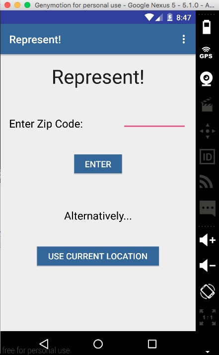
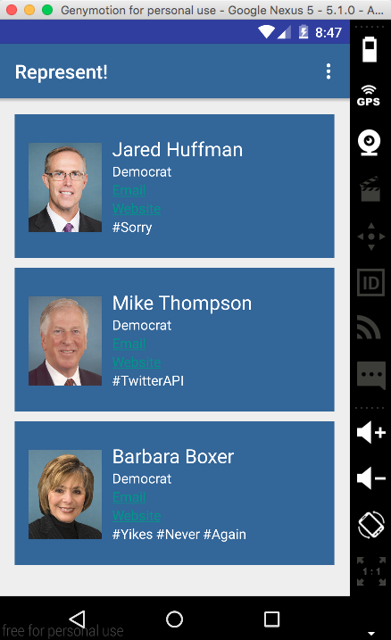
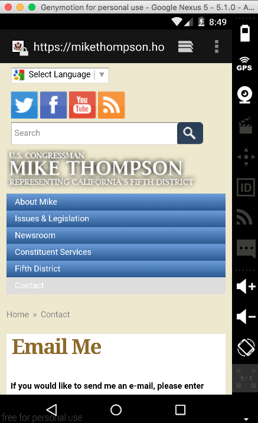
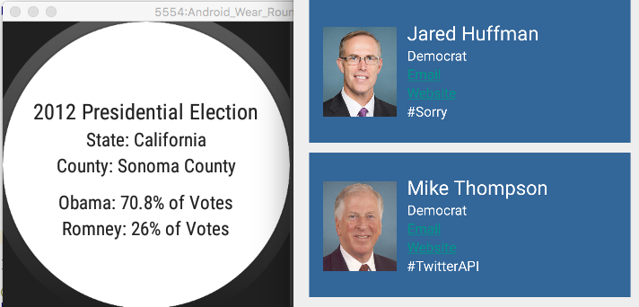

# PROG 02: Represent!

The title of my project is ‘Represent!’ First, the phone’s starting screen prompts the user to input a zip code or select his/her current location. Then, the user can view a list of congress members, along with some basic information such as email and website, in that district. This will also bring up the politicians on the smart watch, and the last screen on the watch will have the 2012 Presidential Election voting data for that county. Clicking on the image of any one of these politicians, either on the phone or the watch, will lead the user to a detailed view of that politician, which includes more information such as the committees this politician serves on or the bills this politician sponsored. Lastly, shaking the watch will return a random location in the United States and update the views accordingly.

## Authors

Brian Chang ([brian.chang@berkeley.edu](mailto:brian.chang@berkeley.edu))

## Demo Video

See [Represent!](https://www.youtube.com/watch?v=_pBQVHYg5pk)

## Screenshots

## Acknowledgments

I'd like to thank all the StackOverflowers and the Googlers for their code snippets
and documentation. Thanks to the TA's for helping me throughout the ride.